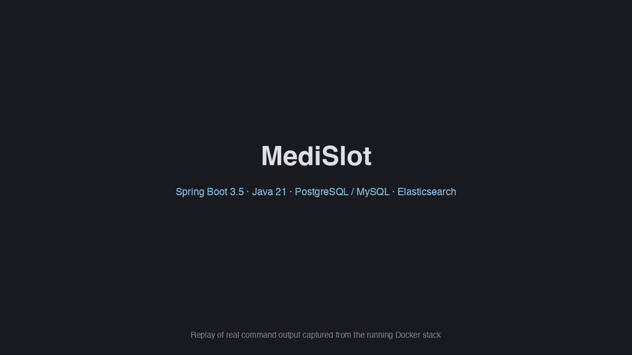

# MediSlot

[](https://github.com/habibour/mediSlot/actions/workflows/ci.yml)

Secure appointment-booking and records REST API for a clinic. **Java 21 · Spring Boot 3.5 · Spring Security (JWT) · Spring Data JPA · Spring AOP · PostgreSQL / MySQL · Elasticsearch · Docker.**

It is a portfolio project that puts the pieces of a health-tech backend in one codebase: role-based access to sensitive data, bookings that cannot double-book under concurrency, an audit trail of who read what, and fuzzy search.

## Demo



[Watch as MP4](docs/demo/mediSlot-demo.mp4) (about 30 seconds). This is a replay of real command output captured from the running Docker stack, not a live screen recording: the stack status, the narrated end-to-end flow, a race of 20 simultaneous bookings (exactly one wins) and the Postman run. Reproduce every scene yourself with `./scripts/demo.sh` and `./scripts/race-demo.sh` once the stack is up (see Quick start).

## Features

- **Roles and security.** Patient / doctor / admin with stateless JWT, BCrypt, URL-level and `@PreAuthorize` checks, and object-level ownership rules (a patient sees only their records; a doctor only patients they have an appointment with). Errors are RFC 7807 `ProblemDetail`.
- **Booking that cannot double-book.** Slot rules are Strategy beans (working hours and grid alignment in the clinic's time zone, minimum lead time, no overlap). Booking takes row locks on patient then doctor, with a partial unique index and `@Version` as backstops. Concurrency tests fire 20 simultaneous requests and expect exactly one booking, including one patient racing across 20 doctors.
- **Audit trail (Spring AOP).** `@Audited` records every successful read or write of patient data (actor, role, action, resource). Admins can query it with filters. A failed audit write never fails the request.
- **Events.** After-commit listeners (Observer) send notifications through a channel Factory (email/SMS, stubbed transports that log masked recipients) and keep Elasticsearch in sync, so rolled-back transactions never trigger side effects.
- **Search.** Typo-tolerant doctor and patient search on Elasticsearch. The index holds names only. Hits are loaded back through the normal services, so authorisation still applies. Admin reindex endpoint.
- **Data protection.** National ID is encrypted at rest (AES-256-GCM, per-value IV), returned masked, and kept out of logs and the search index.
- **Two databases.** Flyway migrations for PostgreSQL and MySQL; the same test suite passes on both.

## Architecture

```
Client ──► Security filter chain (JWT) ──► Controller (DTOs, validation)
                                              │
                          Service (@Transactional, slot policies, events)
                           │            │                │
                      Repository     Spring AOP       Spring events (after commit)
                   (Spring Data JPA)  AuditAspect      ├─► NotificationListener ─► Factory ─► Email/SMS (stubs)
                           │          TimingAspect     └─► SearchIndexListener ──► Elasticsearch
                  PostgreSQL | MySQL
```

Packages: `auth`, `user`, `patient`, `doctor`, `appointment` (+ `policy`, `event`), `prescription`, `notification`, `audit`, `search`, `security`, `common`, `config`. Schema: [`docs/er-diagram.md`](docs/er-diagram.md).

## Quick start

Requires Docker.

```bash
./scripts/gen-env.sh                 # writes .env with generated secrets (never committed)
docker compose up --build            # API + PostgreSQL + Elasticsearch
curl localhost:8081/actuator/health  # {"status":"UP",...}
```

- Watch it work: `./scripts/demo.sh` walks through registration, security checks, booking rules, search and the audit trail; `./scripts/race-demo.sh` fires 20 simultaneous bookings at one slot (expect one `201` and nineteen `409`).
- API: `http://localhost:8081` · Swagger UI: `http://localhost:8081/swagger-ui.html` (use *Authorize* with a token from `POST /api/auth/login`).
- Dev login (seeded by a migration, **change before any real deployment**): `admin@medislot.local` / `Admin@12345`.
- Only the API port is published; PostgreSQL and Elasticsearch stay on the internal Docker network.

### Local development (app on the host, infrastructure in Docker)

```bash
docker compose -f docker-compose.dev.yml up -d          # PostgreSQL 5432 + Elasticsearch 9200
SPRING_PROFILES_ACTIVE=dev ./mvnw spring-boot:run       # http://localhost:8081
```

Add the `seed` profile (`dev,seed`) for 1,000 doctors and 10,000 patients, or `dev,mysql` with `docker-compose.mysql.yml` to run on MySQL.

## Tests

```bash
./mvnw verify                      # unit + integration tests on PostgreSQL, then the coverage gate
./mvnw verify -Dtest.db=mysql      # the same suite on MySQL 8.4
```

83 tests: JUnit 5, Mockito, Spring MockMvc security tests and Testcontainers (PostgreSQL or MySQL, plus Elasticsearch). `verify` merges unit and integration coverage with JaCoCo and fails below 90% line coverage (currently about 95%). Notable tests: the three concurrent-booking races, an after-commit vs rollback test for events, and `StoredValuesIT`, which asserts on what is physically stored in the database (it exists because of a time-zone bug that API round-trip tests could not see; see [`docs/notes.md`](docs/notes.md)).

CI ([`.github/workflows/ci.yml`](.github/workflows/ci.yml)) runs the PostgreSQL suite with the coverage gate, the MySQL suite, and an end-to-end job that builds the Docker stack and runs the Postman collection.

## API tooling

[`postman/`](postman) holds a collection (40 requests, 56 assertions: happy path, 401/403/404/409/422 cases, masked national ID, search, audit) and a local environment. Import both into Postman, or run headless:

```bash
npx newman run postman/MediSlot.postman_collection.json -e postman/MediSlot.local.postman_environment.json
```

Each run registers fresh users and a doctor, so it can be repeated against the same database.

## Design patterns

| Pattern | Where |
|---|---|
| Strategy | `SlotPolicy` implementations (`WorkingHoursPolicy`, `MinLeadTimePolicy`, `NoOverlapPolicy`) injected as a list |
| Factory | `NotificationSenderFactory` resolves `EmailSender` / `SmsSender` by channel |
| Builder | `Notification.builder()` |
| Observer | `AppointmentBookedEvent` / `…CancelledEvent` and `DoctorChangedEvent` / `PatientChangedEvent` with `@TransactionalEventListener(AFTER_COMMIT)` |
| Proxy (Spring AOP) | `AuditAspect`, `TimingAspect`, `@Transactional`, method security |
| Repository / DTO / layered architecture | throughout; entities are never returned from controllers |

## What the job post asks for, and where it is covered

| Requirement | Status |
|---|---|
| Java, OOP, design patterns | Yes: see the table above |
| Spring Boot, Security, Data, AOP, DI | Yes (constructor injection only) |
| PostgreSQL, MySQL | Yes: both tested. **Oracle: not implemented** |
| Elasticsearch | Yes: fuzzy search, indexing, reindex |
| JUnit, Mockito | Yes (plus Testcontainers) |
| Git, CI | Yes: GitHub Actions |
| Docker / cloud | Docker image and compose stack: yes. AWS: [deployment runbook](docs/deploy-aws.md) only, **not deployed** |
| Postman | Yes: collection with assertions |
| DBeaver | Not used; the ER diagram is a hand-maintained Mermaid file |

## Security notes

- Secrets come from environment variables; compose refuses to start without them and `.env` is git-ignored. Only the development profile has placeholder defaults.
- Passwords are BCrypt-hashed. Login returns the same error for unknown email and wrong password and does comparable work for both.
- JWTs are HS256, one hour, signed with a secret of at least 32 bytes (the app fails fast on a shorter one). Forged payloads and tampered signatures are covered by tests.
- Logs carry no email, name, phone or national ID; notification stubs mask recipients.

## Known limitations

- Not hosted anywhere; see the runbook.
- The seeded admin account has a documented password and there is no password-change endpoint or forced rotation. The runbook shows how to replace the hash.
- Notifications are stubs (they log, they do not send).
- Elasticsearch runs as a single node with security disabled on the private Docker network.
- No refresh tokens, rate limiting or account lockout.
- Searchable-after-write is eventually consistent (about a second); `POST /api/admin/search/reindex` repairs any gap.

## How AI tools were used

This project was built with Claude Code as a pair-programming assistant: scaffolding, test writing, documentation drafts and review. Practices that kept it honest:

- Nothing was accepted on trust. Behaviour is pinned by tests, and the important ones were mutation-checked (for example, removing the patient row lock makes the cross-doctor race test fail, which proved the unique index alone was not enough).
- Review caught real defects that passing tests had hidden: a global JDBC time-zone setting that shifted stored working hours by six hours (API tests still passed because writes and reads shifted together), `*IT` tests that were silently not being run, and validation running before the role check.
- Specs and plans in `docs/` were written first and corrected when implementation disagreed with them.

## Documentation

[`docs/prd.md`](docs/prd.md) requirements · [`docs/day1-spec.md`](docs/day1-spec.md) / [`day2`](docs/day2-spec.md) / [`day3`](docs/day3-spec.md) with matching plans · [`docs/notes.md`](docs/notes.md) measurements, gotchas and interview notes · [`docs/er-diagram.md`](docs/er-diagram.md) · [`docs/deploy-aws.md`](docs/deploy-aws.md)
