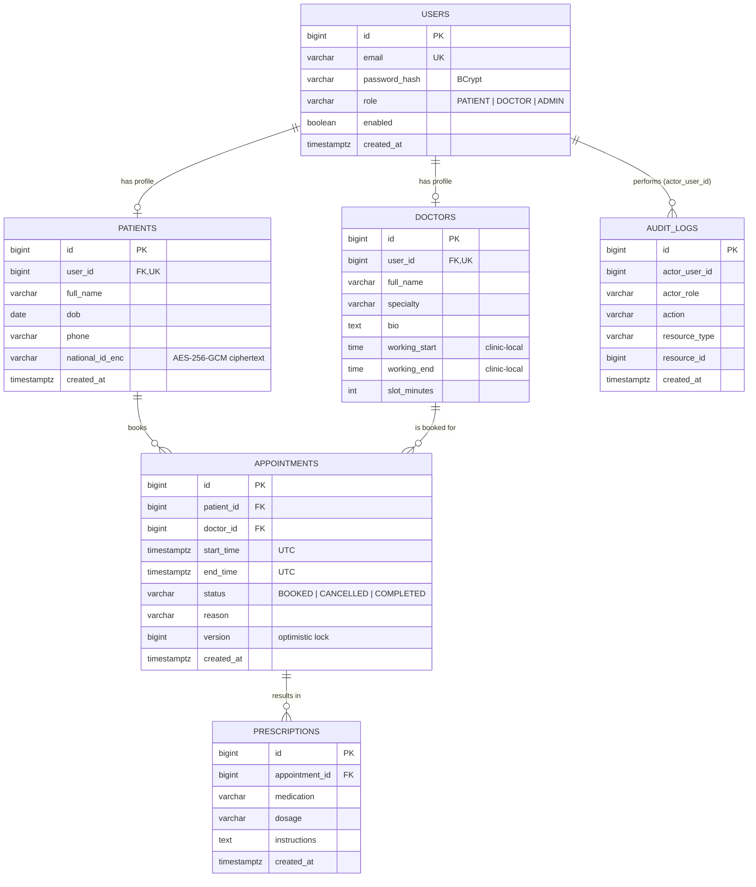

# Entity-relationship diagram

Derived from the Flyway migrations (`src/main/resources/db/migration/postgresql/V1`–`V3`; the MySQL scripts define the same tables).
This is a hand-maintained Mermaid diagram, not an export from a database tool; it renders on GitHub.

Notable constraints:

- `appointments`: partial unique index on `(doctor_id, start_time) WHERE status = 'BOOKED'` (MySQL: generated column `active_start` + unique index), so a cancelled slot can be booked again.
- `appointments.end_time > start_time`, `doctors.working_start < working_end`, `doctors.slot_minutes BETWEEN 5 AND 240` are enforced by `CHECK` constraints.
- `audit_logs.actor_user_id` is deliberately not a foreign key: the trail must survive user changes.
